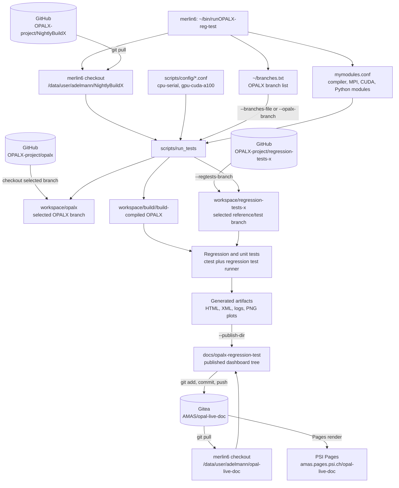

# NightlyBuildX

Automated build and testing framework for OPALX. This repository contains scripts to fetch, build, and test the OPALX project and its regression tests.

NightlyBuildX supports both the full nightly workflow and local result-analysis workflows. `--run-local-now` compares existing outputs without updating repositories, rebuilding OPALX, rerunning tests, or launching new simulations. `--only-generate-web-page` can be used from either a single test directory or the parent `RegressionTests` directory and generates the usual regression HTML/XML report locally, including copied plot assets and index pages.

Published regression pages use a modern read-only results dashboard for already completed runs. The dashboard is organized by OPALX branch and architecture, preserves existing result file names, and is suitable for publishing to `opal-live-doc`. Pushing the generated `opal-live-doc` content triggers the Pages render; the HTML generation step itself does not rename result pages or plot assets.

Regression comparison plotting supports two backends. By default the suite uses gnuplot; with `--no-gpl` it switches to a Python/matplotlib backend. The wrapper checks these dependencies early and fails with a clear message if the required plotting tool is not available. Generated comparison plots are square, have no embedded plot title, and use shared scientific exponent offsets where applicable.

The reporting side also includes `plot-summary.html`, per-test `timing-overview` plots when both `timing.dat` and `reference/timing.dat` are available, result-page plot sliders that select one plot to display, and run metadata with host, architecture, backend, ranks, threads, and device. `scripts/run_tests` accepts `--opalx-branch` and `--regtests-branch` so the OPALX branch and regression-test reference branch can be overridden directly while still allowing configuration files to provide defaults.

## Overview

The core of this system is the `scripts/run_tests` bash script:
1.  **Setup**: Creates a workspace directory structure.
2.  **Fetch**: Clones or updates the OPALX source code and regression tests repositories.
3.  **Build**: Compiles OPALX.
4.  **Test**: Runs regression tests.
5.  **Report**: Generates HTML reports organized by architecture:
    - **Branch selector**: Top-level read-only overview at `overview/index.html`.
    - **Branch landing page**: Single overview showing all published architectures at `overview/<branch>/index.html`.
    - **Architecture-specific pages**: Detailed history per branch/configuration pair.
    - **Test results**: Individual result pages with metadata, summaries, one-plot-at-a-time browsing, and links to logs and plots.

## Usage

To run the standard workflow (update, build if needed, test if needed):

```bash
./scripts/run_tests
```

## OPALX Lab GUI

NightlyBuildX also includes a local browser GUI for day-to-day regression-test work:

**Status:** OPALX Lab GUI is experimental and not ready for production use. It is useful for local exploration and workflow prototyping, but the production nightly workflow should continue to use wrapper scripts such as `~/bin/runOPALX-reg-test` and `scripts/run_tests` directly.

```bash
python3 -B gui/opalx_gui.py
```

By default it starts a local web server and prints the URL to open in a browser. If the default port is already used, choose another one:

```bash
OPALX_GUI_PORT=8769 python3 -B gui/opalx_gui.py
```

### GUI Prerequisites

Before using OPALX Lab, prepare these local paths:

*   **NightlyBuildX checkout**: Run the GUI from this repository.
*   **OPALX source checkout**: Keep at least one local OPALX source checkout, typically `~/git/opalx`.
*   **OPALX build directory**: For reusing an existing executable, the build directory must contain `src/opalx`, for example `~/git/opalx/build/src/opalx`.
*   **Regression tests checkout**: The GUI uses `workspace/regression-tests-x` for Run Builder tests. If it does not exist, `scripts/run_tests` can create/update it during a run.
*   **Publish directory**: Results are written to the selected publish directory, defaulting to `~/opalx-html`.
*   **Python plotting**: The default GUI command enables Python plots (`--no-gpl`), so `matplotlib` must be importable by `python3`.
*   **Unit tests**: To run unit tests from an existing build, the OPALX build must have unit tests enabled and be usable with `ctest`.

The **Run Builder** source selector can point either to an OPALX source directory or to an existing OPALX build directory. If a source directory has a matching local build, OPALX Lab reuses that build when `Compile` is unchecked. If `Compile` is checked, the managed workspace checkout/build is used.

The **Reference Builder** uses the executable selected in Run Builder. Its regression-test source field can be edited; paths under the home directory are shown as `~`, and both `~` and `$HOME` are accepted as input.

Runtime GUI state is stored in:

```text
gui/ui-state.json
gui/run-history.json
```

Delete `gui/run-history.json` for a clean Results Browser history. Published XML/HTML/plots under `~/opalx-html` are not removed.

### Options

*   `--config=FILE`: Specify a configuration file (e.g., from `scripts/config/`).
*   `--publish-dir=DIR`: Directory to publish HTML results.
*   `--branches-file=FILE`: Read OPALX branches to build and test. If `~/branches.txt` exists and `--opalx-branch` is not set, it is used automatically.
*   `--opalx-branch=BRANCH`: Select one OPALX branch explicitly, overriding the branch list.
*   `--regtests-branch=BRANCH`: Select the regression-tests-x branch used for tests and references.
*   `--force`, `-f`: Force compilation and running of all tests.
*   `--compile`: Force compilation.
*   `--no-clean-after-compile`: Keep build artifacts after a successful compile/test cycle. By default the build tree is cleaned after tests to save storage while preserving the configured build tree.
*   `--unit-tests`: Force running unit tests (runs `ctest -L unit` in the build directory; requires `OPALX_ENABLE_UNIT_TESTS=ON` in your config).
*   `--reg-tests`: Force running regression tests.
*   `--test`: Run only the `Spin-Tracking` regression test.
*   `--test=NAME`: Run only one named regression test.
*   `--doNotCompileRun`: Re-render published overview HTML from existing
    results under `--publish-dir` without updating repositories, compiling, or
    running unit/regression tests. Existing published branch, architecture, and
    result names are preserved. This is useful for testing the pushed
    `opal-live-doc` result GUI on already available nightly data.

## Published Results GUI

The published HTML under `<publish-dir>/overview` and `<publish-dir>/regressionTests` is a read-only browser for data from already completed nightly or local runs. It does not configure, compile, or start simulations. Those actions remain controlled by `scripts/run_tests`, the local OPALX Lab GUI, wrapper scripts, or cron jobs.

The top-level overview lists available branches. A branch page lists available architectures for that branch, and an architecture page lists the available result dates. Result pages use the same file names as before, for example:

```text
regressionTests/<branch>/<architecture>/results_<date>_<time>.html
```

Each result page contains:

*   A run metadata block with host, architecture, backend, ranks, threads, and device when that information is available.
*   Regression summary tables.
*   A plot browser per test. The horizontal slider selects which plot frame is visible; it does not scroll the table.
*   Native horizontal scrolling for wide tables.
*   Links to copied plot assets and logs.

Use render-only mode to refresh the published dashboard from existing data:

```bash
./scripts/run_tests --doNotCompileRun --publish-dir /path/to/opal-live-doc/docs/opalx-regression-test
```

For `opal-live-doc`, commit and push the generated files after review. The Pages pipeline renders the published site from the pushed repository content.

## Cleanup Published Results

NightlyBuildX can clean the current published result tree before committing it to `opal-live-doc`. This removes files from the current repository checkout only; it does not rewrite Git history and it does not push.

Cleanup is dry-run by default:

```bash
./scripts/run_tests \
    --publish-dir /path/to/opal-live-doc/docs/opalx-regression-test \
    --cleanup-repo-to 2025-12-01
```

Dates must use ISO format `YYYY-MM-DD`. Ambiguous formats such as `12-01-2025` are rejected.

Apply date-based cleanup with:

```bash
./scripts/run_tests \
    --publish-dir /path/to/opal-live-doc/docs/opalx-regression-test \
    --cleanup-repo-to 2025-12-01 \
    --cleanup-apply
```

This deletes published artifacts up to and including the selected date:

```text
regressionTests/<branch>/<architecture>/results_YYYY-MM-DD_HH-MM.html
regressionTests/<branch>/<architecture>/results_YYYY-MM-DD_HH-MM.xml
regressionTests/<branch>/<architecture>/plots_YYYY-MM-DD_HH-MM/
unitTests/<branch>/<architecture>/results_YYYY-MM-DD_HH-MM.txt
output/<branch>/<architecture>/YYYY-MM-DD_HH-MM.txt
```

It also removes matching rows from `overview/<branch>/<architecture>/index.org` and regenerates the overview HTML pages.

Delete published branch trees with:

```bash
./scripts/run_tests \
    --publish-dir /path/to/opal-live-doc/docs/opalx-regression-test \
    --delete-branches a1,s2,d3 \
    --cleanup-apply
```

This removes:

```text
overview/<branch>/
regressionTests/<branch>/
unitTests/<branch>/
output/<branch>/
```

Review and publish from the `opal-live-doc` checkout:

```bash
git status
git diff --stat
git add docs/opalx-regression-test
git commit -m "cleanup old opalx regression results"
git push
```

## Production Wrapper Example

On `merlin6`, the cron-style wrapper `~/bin/runOPALX-reg-test` shows how the scripts are normally composed for published nightly output. The wrapper keeps the site and NightlyBuildX checkouts current, chooses branches, runs both GPU and CPU configurations, and then publishes the regenerated `opal-live-doc` content.

The repository and script relationships look like this:



A condensed version of the pattern is:

```bash
#!/bin/bash -l

export OPALLIVEDOC=/path/to/opal-live-doc
export TIMESTAMP="$(date)"

cd "${OPALLIVEDOC}"
git pull -v

cd /path/to/NightlyBuildX/scripts
git pull -v

branch_args=()
if [[ $# -gt 0 ]]; then
    branch_args=(--opalx-branch "$1")
else
    branch_args=(--branches-file "${HOME}/branches.txt")
fi

source "${HOME}/mymodules.conf"
export OMP_PLACES=threads
export OMP_PROC_BIND=spread

bash run_tests \
    --no-clean-after-compile \
    --no-gpl \
    --config ./config/debug-merlin6-a100.conf \
    "${branch_args[@]}" \
    --regtests-branch master \
    --reg-tests \
    --unit-tests \
    --publish-dir "${OPALLIVEDOC}/docs/opalx-regression-test"

bash run_tests \
    --no-clean-after-compile \
    --no-gpl \
    --config ./config/debug-merlin6-cpu.conf \
    "${branch_args[@]}" \
    --regtests-branch master \
    --reg-tests \
    --unit-tests \
    --publish-dir "${OPALLIVEDOC}/docs/opalx-regression-test"

cd "${OPALLIVEDOC}"
git add .
git commit -m "newest test results obtained on ${TIMESTAMP}"
git push
```

Passing one argument runs only that OPALX branch:

```bash
~/bin/runOPALX-reg-test feature/my-branch
```

Running without arguments reads the branch list from `${HOME}/branches.txt`:

```bash
~/bin/runOPALX-reg-test
```

This wrapper is intentionally thin. The build/test behavior comes from the selected `scripts/config/*.conf` files and the `run_tests` options. In particular, `--regtests-branch master` selects the regression-tests-x branch used for tests and references, while `--publish-dir` points both architectures at the same published dashboard tree.

## Deploy to Another Site

To deploy the nightly regression workflow at another computing center, keep the same separation of responsibilities:

*   NightlyBuildX owns orchestration, builds, tests, and HTML generation.
*   OPALX is checked out and built in the NightlyBuildX workspace.
*   `regression-tests-x` provides the test inputs and reference data.
*   A site-local wrapper script loads modules, selects configs and branches, runs `scripts/run_tests`, and publishes generated HTML/PNG/log artifacts.
*   The web repository, for example `opal-live-doc`, only stores already generated documentation and result artifacts.

### 1. Prepare Repositories

Create or select these checkouts on the target machine:

```text
/path/to/NightlyBuildX
/path/to/opal-live-doc
```

NightlyBuildX will manage these working trees below its own `workspace/` directory:

```text
/path/to/NightlyBuildX/workspace/opalx
/path/to/NightlyBuildX/workspace/regression-tests-x
/path/to/NightlyBuildX/workspace/build/<architecture>/build-<branch>
```

The first full run can create/update the OPALX and regression-test checkouts. For production, the wrapper should still run `git pull` in the NightlyBuildX checkout and in the published web checkout before generating new output.

### 2. Define Site Configurations

Add one configuration file per target architecture under `scripts/config/`, for example:

```text
scripts/config/debug-site-cpu.conf
scripts/config/debug-site-gpu.conf
```

Each config should define at least:

```bash
architecture="cpu-serial"
branch="master"
do_regressiontests='yes'
do_unittests='yes'
cmake_args+=("-DCMAKE_BUILD_TYPE=Debug")
cmake_args+=("-DOPALX_ENABLE_UNIT_TESTS=ON")
```

GPU configs must also include the site-specific CMake options, compiler wrappers, CUDA/HIP settings, and scheduler/module assumptions needed by OPALX. Unit tests only run when both `do_unittests='yes'` and the OPALX build cache has `OPALX_ENABLE_UNIT_TESTS=ON`.

### 3. Define the Module Environment

Create a site-local module setup file, for example:

```text
${HOME}/mymodules.conf
```

It should load the compiler, MPI, Python, CMake, plotting, CUDA/HIP, and scheduler integration needed by the selected configs. The wrapper should source this file before calling `scripts/run_tests`.

For Python plotting with `--no-gpl`, make sure `python3` can import `matplotlib`. Without `--no-gpl`, make sure `gnuplot` is available.

### 4. Choose Branch Selection Policy

For a single branch, pass it directly to the wrapper and forward it as:

```bash
--opalx-branch feature/my-branch
```

For a nightly branch set, keep a file such as:

```text
${HOME}/branches.txt
```

with one branch per line:

```text
master
feature/my-branch
```

Forward it to `run_tests` with:

```bash
--branches-file "${HOME}/branches.txt"
```

Select the regression-test/reference branch independently:

```bash
--regtests-branch master
```

### 5. Create the Published Output Tree

Choose the publish directory inside the web repository:

```text
/path/to/opal-live-doc/docs/opalx-regression-test
```

All architectures and branches should publish into the same root. The generated layout is:

```text
docs/opalx-regression-test/
  overview/
  regressionTests/<branch>/<architecture>/
  unitTests/<branch>/<architecture>/
```

Do not rename generated result pages or plot directories after publication. The dashboard expects the existing names.

### 6. Write the Site Wrapper

Use a thin wrapper that updates repositories, sets the environment, chooses branches, runs each architecture, and then publishes the web repository:

```bash
#!/bin/bash -l
set -euo pipefail

export NIGHTLYBUILDX=/path/to/NightlyBuildX
export LIVEDOC=/path/to/opal-live-doc
export PUBLISH_DIR="${LIVEDOC}/docs/opalx-regression-test"
export TIMESTAMP="$(date)"

cd "${LIVEDOC}"
git pull -v

cd "${NIGHTLYBUILDX}"
git pull -v

branch_args=()
if [[ $# -gt 0 ]]; then
    branch_args=(--opalx-branch "$1")
else
    branch_args=(--branches-file "${HOME}/branches.txt")
fi

source "${HOME}/mymodules.conf"

cd "${NIGHTLYBUILDX}/scripts"

bash run_tests \
    --no-clean-after-compile \
    --no-gpl \
    --config ./config/debug-site-gpu.conf \
    "${branch_args[@]}" \
    --regtests-branch master \
    --reg-tests \
    --unit-tests \
    --publish-dir "${PUBLISH_DIR}"

bash run_tests \
    --no-clean-after-compile \
    --no-gpl \
    --config ./config/debug-site-cpu.conf \
    "${branch_args[@]}" \
    --regtests-branch master \
    --reg-tests \
    --unit-tests \
    --publish-dir "${PUBLISH_DIR}"

cd "${LIVEDOC}"
git add docs/opalx-regression-test
git commit -m "newest test results obtained on ${TIMESTAMP}"
git push
```

### 7. Validate Without Running Tests

Before enabling the wrapper in cron or a scheduler, validate the HTML generation from existing data:

```bash
cd /path/to/NightlyBuildX/scripts
bash run_tests --doNotCompileRun --publish-dir /path/to/opal-live-doc/docs/opalx-regression-test
```

Review:

```text
overview/index.html
overview/<branch>/index.html
overview/<branch>/<architecture>/index.html
regressionTests/<branch>/<architecture>/results_<date>_<time>.html
```

Then commit and push the web repository to trigger the site renderer.

### 8. Operational Checks

For the first production run at a new site, check:

*   The wrapper can update both repositories.
*   The selected OPALX branches exist.
*   The selected `regression-tests-x` branch exists.
*   Each config creates a distinct `architecture` name.
*   OPALX builds in `workspace/build/<architecture>/build-<branch>`.
*   `ctest -L unit` finds tests when unit tests are enabled.
*   Regression result pages contain plots and logs.
*   `overview/index.html` lists all expected branches.
*   The web repository push triggers the public site render.

### Example

Run with a specific configuration (e.g., Debug CPU):

```bash
bash NightlyBuildX/scripts/run_tests \
    --config=NightlyBuildX/scripts/config/debug-cpu.conf \
    --publish-dir=regtest-results
```

## Directory Structure

The script creates a `workspace` directory (ignored by git) where all work happens:

```
workspace/
  opalx/              # Single OPALX checkout; branches are selected with git checkout
  regression-tests-x/ # Single regression-tests checkout
  build/
    <architecture>/
      build-<branch>/ # Reused build directory for the selected OPALX branch/config
```

This structure allows:
- **One OPALX clone** reused by checking out branches instead of cloning per branch
- **One regression test clone** reused by checking out the selected tests branch
- **Stable build directories** per architecture and OPALX branch

## Configuration

Configuration files in `scripts/config/` allow you to customize:
*   Git branches for source and tests.
*   CMake arguments (e.g., Build type, Platforms).
*   OPALX arguments.
*   **Architecture**: Define the build architecture (e.g., `cpu-serial`, `cpu-openmp`, `gpu-cuda-a100`). This organizes builds and test results by architecture, allowing multiple configurations to run independently.
*   **Unit tests**: Set `do_unittests='yes'` in the config to run unit tests (`ctest -L unit`) after each build when using that config; set to `'no'` to disable. The provided configs enable unit tests by default.

### Example Configuration

```bash
# scripts/config/debug-cpu.conf
architecture="cpu-serial"
branch="master"
cmake_args+=("-DBUILD_TYPE=Debug")
cmake_args+=("-DPLATFORMS=SERIAL")
```

The architecture setting affects:
*   Build directory layout: `workspace/build/<architecture>/build-<branch>/`
*   Published results structure: `<publish-dir>/<test-type>/<branch>/<architecture>/`
*   HTML report titles to clearly identify which architecture was tested

**Note**: Source code and tests use one shared checkout each. Switching branches happens with `git checkout`, and build directories are reused by architecture and OPALX branch. Branch names are sanitized only for directory names, for example `feature/foo` becomes `feature_foo`.

## Branch Lists

`scripts/run_tests` reads `~/branches.txt` by default when `--opalx-branch` is not supplied. Each non-empty, non-comment line is treated as one OPALX branch:

```text
master
feature/my-branch
```

For each branch, NightlyBuildX checks out the single managed OPALX source tree at `workspace/opalx`, builds in `workspace/build/<architecture>/build-<branch>/`, runs the requested tests, and publishes results under the branch-specific HTML tree.

The local wrapper `~/bin/runOPALX-reg-test-local` continues to run a single branch because it passes `--opalx-branch`. Omit that option, or pass `--branches-file=~/branches.txt`, to run all branches from the file.

## Unit Tests

Unit tests are run with `ctest -L unit` when `do_unittests='yes'` is set for the active configuration and the OPALX build was configured with unit tests enabled. The CMake cache must contain `OPALX_ENABLE_UNIT_TESTS=ON`; otherwise `ctest -L unit` will find no unit tests even if `do_unittests='yes'` is set.

## Regression Tests
The regression tests are located on the `cleanup` branch in the [regression-tests-x](https://github.com/OPALX-project/regression-tests-x/tree/cleanup) repository of the OPALX project.
